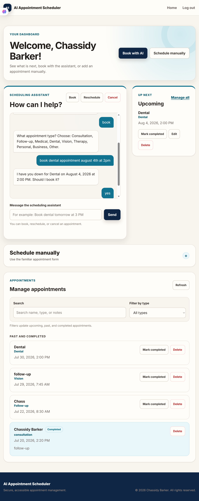

# AI Appointment Scheduler

[](https://github.com/chassbarker/ai-appointment-scheduler/actions/workflows/tests.yml)

A responsive appointment-management application built with Supabase Authentication, PostgreSQL, HTML, CSS, and JavaScript.

**Live demo:** [View the AI Appointment Scheduler](https://chassbarker.github.io/ai-appointment-scheduler/)

 

## Project status

This is an actively developed portfolio project demonstrating secure authentication, appointment management, conversational scheduling, responsive design, accessibility, automated testing, and Supabase integration.

## Features

- Full-name account creation, email/password login, logout, and password recovery
- Protected dashboard and personalized welcome message
- Conversational assistant for booking, rescheduling, and cancelling appointments
- Provider-aware scheduling with multiple-provider support
- Weekly provider hours, lunch closures, time off, and time-zone configuration
- Appointment durations with database-enforced overlap prevention
- Two-hour advance notice and a 90-day booking window
- Cancellation history with completed, cancelled, and no-show statuses
- Multi-field appointment extraction with one-at-a-time follow-up prompts
- Explicit appointment selection and confirmation before changes
- Create, view, edit, complete, and delete appointments
- Appointment type and 12-hour time selectors
- Search and appointment-type filtering
- Separate upcoming and past/completed appointment sections
- Past-date and past-time validation
- User-specific access enforced with PostgreSQL Row Level Security
- Responsive, keyboard-accessible interface
- Accessible conversation log, focus management, and live loading/error status
- Safe DOM rendering for user-entered details
- Custom GitHub Pages 404 page

## Technology

- Supabase Authentication and Data API
- PostgreSQL with Row Level Security
- HTML5
- CSS3
- Vanilla JavaScript
- Node.js test runner
- Git and GitHub
- GitHub Pages
- GitHub Actions for continuous integration

## Scheduling assistant architecture

The protected dashboard loads `js/scheduling-assistant.js` after the authentication and appointment modules. The assistant uses a deterministic client-side conversation state machine. It does not currently call an external AI service or require a private API key.

### Booking

The assistant recognizes booking intent and extracts an allowed appointment type, date, and time. It can identify multiple values from one message and asks for one missing value at a time. An appointment is inserted only after the user confirms the booking.

### Rescheduling and cancellation

Rescheduling and cancellation requests query the authenticated user's upcoming appointments and display an explicit appointment-selection list. The assistant does not infer which appointment to change from descriptive text alone.

Rescheduling validates the replacement date and time before requesting confirmation. Cancellation also requires confirmation before an appointment is deleted.

### Data protection

Every select, insert, update, and delete operation uses the current Supabase session and includes a `user_id` restriction. PostgreSQL Row Level Security provides the final authorization boundary.

Conversation content is rendered with DOM text nodes and `textContent`. User-entered content is never inserted with `innerHTML`.

## Security

This project uses a Supabase publishable key in the browser, as intended for public frontend applications. PostgreSQL Row Level Security policies restrict appointment operations to the authenticated user's own records.

The scheduling database contains `providers`, `provider_availability`, `provider_time_off`, and `appointments`.

The `appointments` table contains:

- `id`
- `user_id`
- `provider_id`
- `name`
- `type`
- `date`
- `time`
- `duration_minutes`
- `notes`
- `status`
- `cancelled_at`
- `completed_at`
- `no_show_at`
- `created_at`
- `updated_at`

Every database operation is restricted to rows whose `user_id` matches `auth.uid()`.

No service-role keys, database passwords, or private API keys are included in the frontend.

## Testing

GitHub Actions automatically runs the appointment-management and scheduling-assistant tests for pull requests targeting `main` and changes pushed to `main`.
Run both automated test files from the project directory:

```powershell
node --test tests/appointments.test.cjs tests/scheduling-assistant.test.cjs
```

Current automated test results:

- 2 test files passed
- 0 failures
- Appointment-management interactions passed
- Scheduling-assistant interactions passed

### Manual testing checklist

- Create and confirm an account
- Log in, log out, and reset a password
- Create, edit, complete, and delete an appointment
- Ask the assistant to book with all fields in one message
- Ask the assistant to book with fields in separate messages
- Verify the assistant asks for only one missing field at a time
- Try an unsupported appointment type
- Try an impossible date, past date or time, and malformed time
- Verify the assistant summarizes the booking details before saving
- Decline a booking and confirm that no appointment is inserted
- Start rescheduling and verify upcoming appointments are displayed
- Verify an appointment is not inferred from typed descriptive text
- Select an appointment, enter a new date and time, and decline the change
- Repeat the rescheduling process, confirm it, and verify only the selected appointment changes
- Start cancellation, select an appointment, and decline the cancellation
- Repeat the cancellation process, confirm it, and verify the selected appointment is deleted
- Test assistant loading and Supabase error states
- Verify search and appointment-type filters
- Verify past appointments move to the history section
- Test two accounts to confirm user-data isolation
- Test keyboard navigation and mobile layouts

## Testing notes

The application has been tested with multiple user accounts to verify registration, login, appointment creation, editing, completion, deletion, and user-data isolation.

Testing identified and resolved an issue that prevented appointments from saving when the optional Notes field was blank. Additional browser, mobile, keyboard, and screen-reader testing will continue as the project develops.

A GitHub Actions continuous integration workflow now runs both automated test files whenever a pull request targets `main` or changes are pushed to `main`. This helps identify regressions before new changes are merged or deployed.

## Accessibility

The interface is designed toward WCAG 2.2 Level AA and includes:

- Semantic landmarks
- Skip links
- Visible keyboard focus
- Associated form instructions
- Live status announcements
- Touch-friendly controls
- Reduced-motion support
- Forced-color support
- Responsive reflow

This statement describes the project's accessibility target and is not a guarantee of legal compliance. Automated testing should be supplemented with keyboard, zoom, contrast, and screen-reader testing.

## Setup

1. Create a Supabase project.
2. Run `supabase.sql` in the Supabase SQL Editor to create the database structure.
3. If the table already exists without completion status, run `migration-add-status.sql` once.
4. For an existing project, run `migration-prevent-scheduling-conflicts.sql` once to add providers, availability, durations, status history, and overlap protection.
5. In **Authentication > URL Configuration**, add the deployed website and password-reset URLs.
6. Replace the project URL and publishable key at the top of `js/auth.js` if using a different Supabase project.
7. Serve the project through a local web server or deploy it with GitHub Pages.

### Scheduling assistant setup

No additional environment variables or database migration are required for the assistant. It reuses the Supabase URL and publishable key from `js/auth.js`, the authenticated dashboard session, and the existing `appointments` table.

Service-role keys and other private credentials should never be added to browser files.

## Project structure

```text
css/style.css                         Shared responsive styling
js/auth.js                            Authentication and password recovery
js/providers.js                       Active-provider loading and selection
js/appointments.js                    CRUD, filters, validation, and safe rendering
js/scheduling-assistant.js            Conversational scheduling state machine
tests/appointments.test.cjs           Appointment interaction tests
tests/scheduling-assistant.test.cjs   Scheduling assistant interaction tests
index.html                            Landing page
login.html                            Login and account creation
reset-password.html                   Password reset page
dashboard.html                        Protected appointment dashboard
404.html                              Custom GitHub Pages error page
supabase.sql                          Complete database schema and RLS setup
migration-add-status.sql              Status update for existing databases
migration-prevent-scheduling-conflicts.sql
                                       Provider availability and conflict migration
## Development Setup

AI Appointment Scheduler v2 is being developed on a dedicated feature branch using the AWS serverless development toolchain.

### Prerequisites

- AWS CLI
- AWS SAM CLI
- Node.js
- Git

### Baseline Validation

Before v2 development began:

- The existing appointment and scheduling-assistant tests passed.
- The repository had a clean working tree.
- Version 1 was preserved with the `v1.0.0` release tag.
- Development was moved to the `feature/v2-aws-ai` branch to keep `main` stable.

### Prerequisites

- AWS CLI
- AWS SAM CLI
- Node.js
- Git

### Baseline Validation

Before v2 development began:

- The existing appointment and scheduling-assistant tests passed.
- The repository had a clean working tree.
- Version 1 was preserved with the `v1.0.0` release tag.
- Development was moved to the `feature/v2-aws-ai` branch to keep `main` stable.


## Development Setup

AI Appointment Scheduler v2 is being developed on a dedicated feature branch using the AWS serverless development toolchain.

### Prerequisites

- AWS CLI
- AWS SAM CLI
- Node.js
- Git

### Baseline Validation

Before v2 development began:

- The existing appointment and scheduling-assistant tests passed.
- The repository had a clean working tree.
- Version 1 was preserved with the `v1.0.0` release tag.
- Development was moved to the `feature/v2-aws-ai` branch to keep `main` stable.

### AWS v2 Backend Progress

The first AWS serverless API checkpoint is complete:

- Initialized an AWS SAM backend using Node.js 22
- Replaced the generated Hello World function with `SchedulingFunction`
- Added a `GET /appointments` API Gateway route
- Created an initial Lambda response with an empty appointments collection
- Added a Mocha and Chai unit test for the scheduling function
- Confirmed the unit test passes
- Validated the SAM template
- Confirmed the application builds successfully with the SAM CLI

The AWS backend is currently being developed and tested locally. No AWS resources have been deployed.

## Future improvements

- Connect the assistant to an AI language model
- Add a staff dashboard for provider management and no-show actions
- Generate selectable appointment slots before confirmation
- Send appointment reminders
- Add calendar integration
- Create administrative scheduling tools
- Add more automated accessibility testing
- Expand automated browser and mobile testing

## Important notice

This application is a portfolio demonstration. It is not intended to collect or store real patient information, medical records, or protected health information.

## Connect

- **Portfolio:** [chassidybarker.com](https://chassidybarker.com)
- **LinkedIn:** [Chassidy Barker](https://www.linkedin.com/in/chassidy-barker-02478535a)
- **GitHub:** [chassbarker](https://github.com/chassbarker)

## License

This project is licensed under the MIT License.
